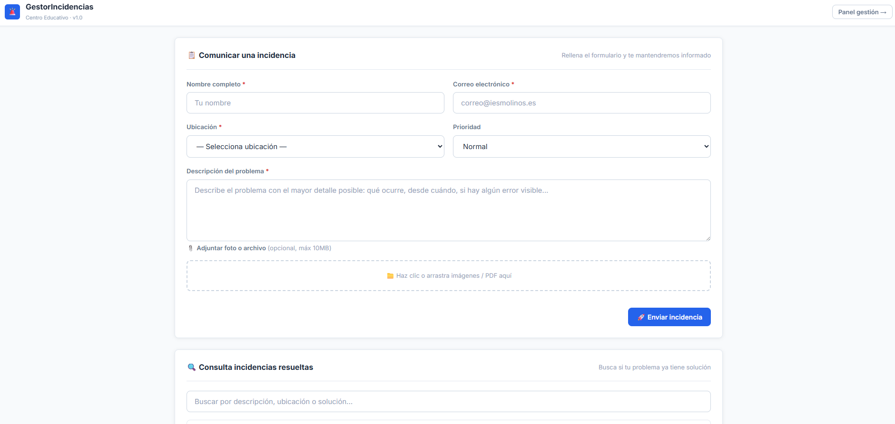
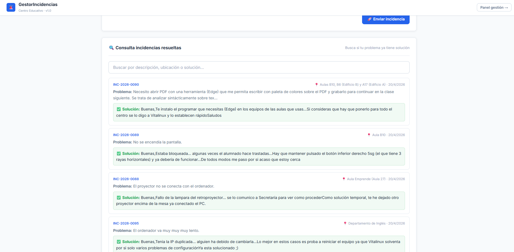
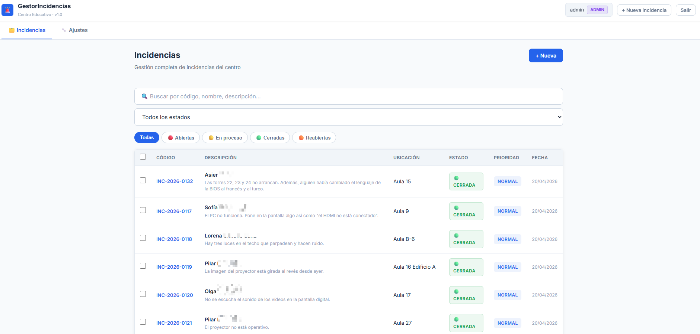
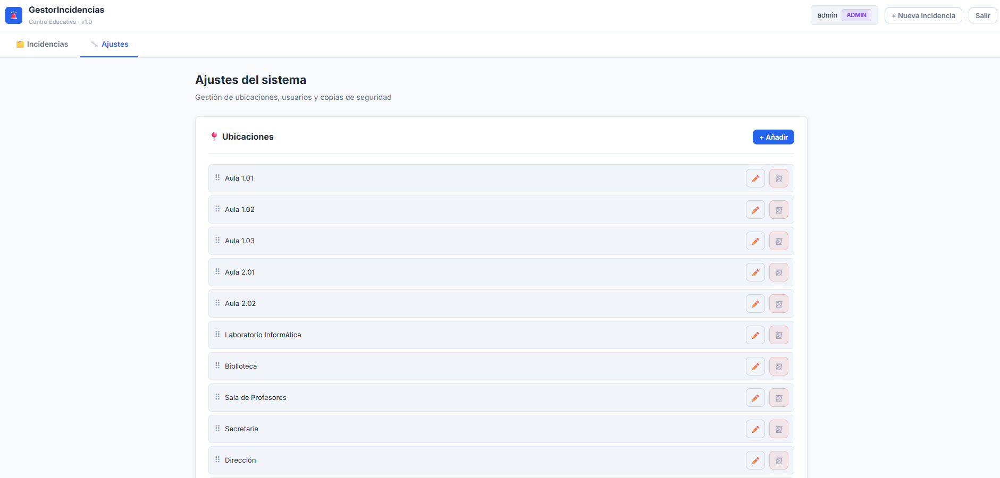
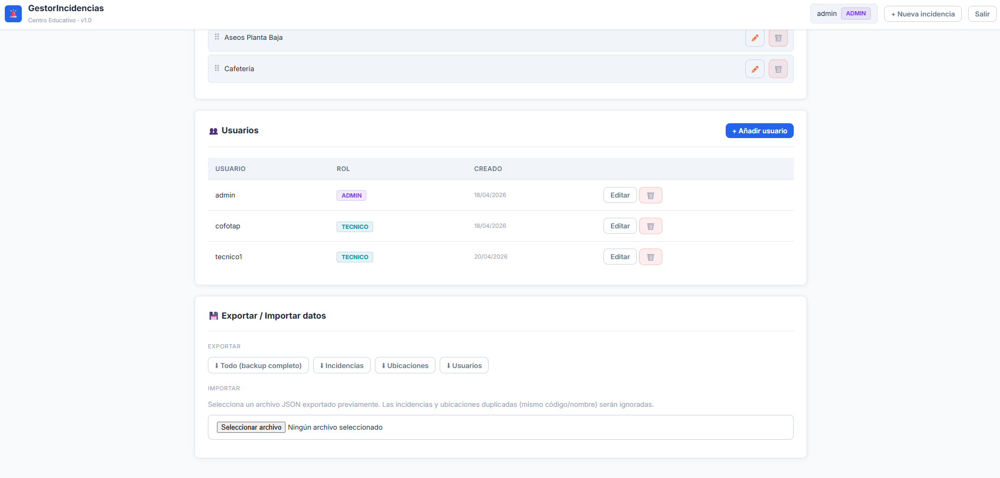

# Gestor Incidencias Simple

Aplicación web para registrar y gestionar **incidencias técnicas** en centros educativos. Cualquier persona puede comunicar una incidencia sin necesidad de cuenta, mientras que el equipo técnico gestiona los estados, soluciones y adjuntos desde un panel privado.

---

## Características generales

- Formulario público de comunicación de incidencias, sin login
- Panel de gestión privado con tres niveles de acceso
- Código automático de seguimiento por incidencia (ej. `INC-2025-0001`)
- Historial de cambios por incidencia
- Búsqueda y filtros en tiempo real
- Botón **Copiar resumen** para pegar en email o documento
- Compatible con Docker en cualquier plataforma (Linux, Windows, macOS, CasaOS)

---
### Crear incidencia

### Buscar incidencias resueltas

### Gestionar incidencias

### Personalización lugares, usuarios...


---


## Características particulares

- **Formulario público**: nombre, email, ubicación, prioridad, descripción y adjuntos/fotos
- **Editor WYSIWYG** (Quill) en el campo Solución: negrita, cursiva, listas, colores, imágenes embebidas
- **Adjuntos y fotos**: drag & drop o selección de archivos (imágenes, PDF — hasta 10 MB), con previsualización en miniatura y lightbox
- **Gestión de ubicaciones** desde el panel admin (añadir, editar, eliminar, ordenar)
- **Gestión de usuarios** desde el panel admin
- **Estados**: Abierta 🔴 → En proceso 🟡 → Cerrada 🟢 / Reabierta 🟠 / Cancelada

---

## Instalación y arranque

**Requisitos:** Docker + Docker Compose

```bash
# 1. Clonar el repositorio
git clone https://github.com/luisjsolsona/Gestor-Incidencias-Simple.git
cd Gestor-Incidencias-Simple

# 2. (Recomendado) Editar docker-compose.yml y cambiar JWT_SECRET

# 3. Construir y arrancar
docker compose up -d --build
```

Acceder en: **http://localhost:7000**

La base de datos se crea automáticamente en el primer arranque.

```bash
# Arranques posteriores
docker compose up -d

# Ver logs
docker compose logs -f

# Parar
docker compose down

# Actualizar tras git pull
docker compose up -d --build
```

---

## Credenciales por defecto

| Usuario   | Contraseña   | Rol      |
|-----------|--------------|----------|
| `admin`   | `admin123`   | admin    |
| `tecnico` | `cofotap123` | tecnico  |

> ⚠️ Cambia las contraseñas en producción desde el panel **Ajustes → Usuarios**.

Para establecer un JWT_SECRET propio antes del primer arranque, edita `docker-compose.yml`:

```yaml
environment:
  - JWT_SECRET=cadena_larga_y_aleatoria
```

---

## Roles / Permisos

| Acción | Público | Usuario | Técnico | Admin |
|--------|:-------:|:-------:|:-------:|:-----:|
| Crear incidencia | ✅ | ✅ | ✅ | ✅ |
| Ver lista de incidencias | ❌ | ✅ | ✅ | ✅ |
| Cambiar estado | ❌ | ❌ | ✅ | ✅ |
| Añadir solución y asignar técnico | ❌ | ❌ | ✅ | ✅ |
| Exportar / Importar datos | ❌ | ❌ | ❌ | ✅ |
| Gestionar ubicaciones | ❌ | ❌ | ❌ | ✅ |
| Gestionar usuarios | ❌ | ❌ | ❌ | ✅ |

---

## Arquitectura

```
Gestor-Incidencias-Simple/
├── docker-compose.yml    # Orquestación del contenedor
├── Dockerfile            # Imagen Node.js Alpine
├── package.json
├── server.js             # Backend: API REST Express + SQLite
├── index.html            # Frontend: SPA completa en un único fichero
└── icon.svg              # Icono de la aplicación
```

**Stack:** Node.js · Express · SQLite (better-sqlite3) · Docker

La base de datos SQLite se persiste en un volumen Docker (`incidencias_data`).

---

## Despliegue en CasaOS

1. Clona el repositorio en tu servidor CasaOS:
   ```bash
   git clone https://github.com/luisjsolsona/Gestor-Incidencias-Simple.git
   ```
2. En la UI de CasaOS ve a **App Store → Custom Install → Import docker-compose**
3. Selecciona el fichero `docker-compose.yml` del repositorio clonado
4. CasaOS detectará automáticamente el nombre, descripción e icono de la app
5. Accede en `http://<ip-casaos>:7000`

> ⚠️ Cambia `JWT_SECRET` en `docker-compose.yml` antes de arrancar en producción.
